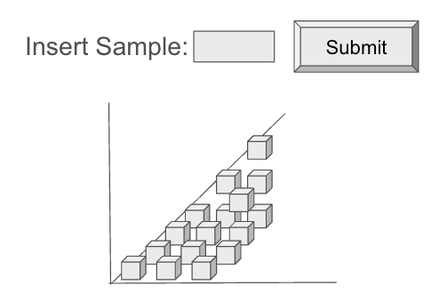

## Start Project

1. Start Server

```
cd server/ && npm install && npm start
```

2. Start Frontend

```
cd client/ && npm install && npm run dev
```

### **Goal:**

Everytime the user clicks the submit button, add a column of cubes to the sceen. The column should have as many cubes as the number that was on the input box at the moment the user clicked on the button. Add new stacks of cubes along one of the horizontal axis (x or z). Wrap around the other axis when a maximum of 3 stacks is reached.



### **Bonus Challenges (Optional)**

🚀 Use Leva to add a slider to change parameters. Ex: maximum stacks until wrap, size of cubes, distance between cubes, etc…

🚀 Implement smooth **animations** when cubes are added.

🚀 Use **shaders** for custom cube appearance (e.g., gradient colors).
